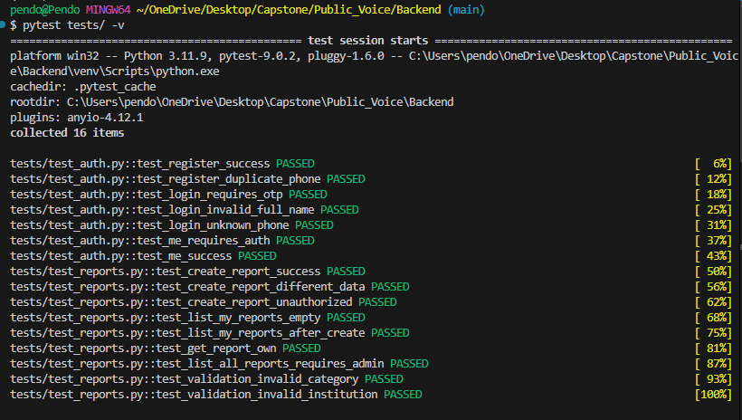
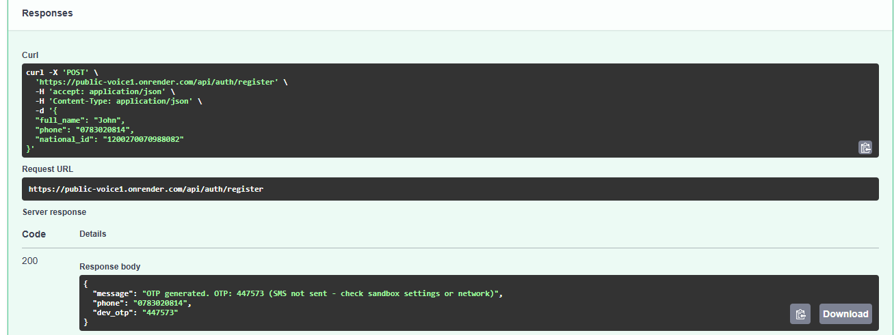
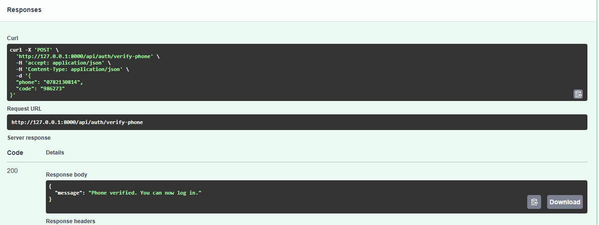
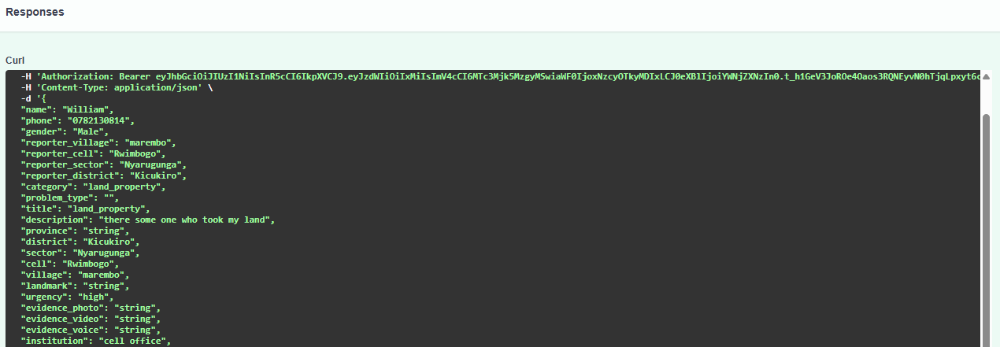
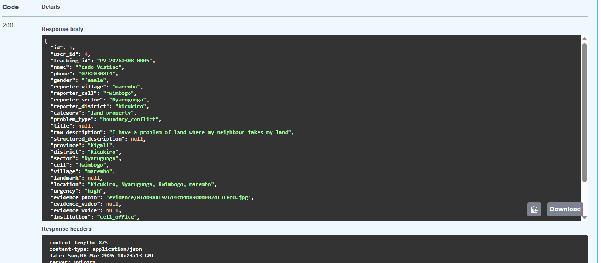
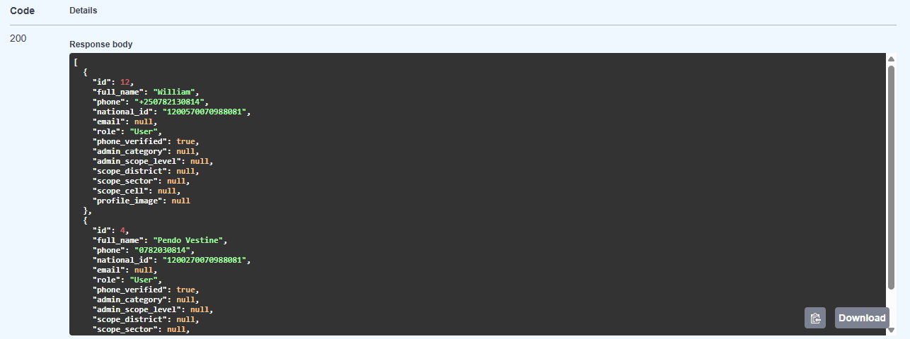
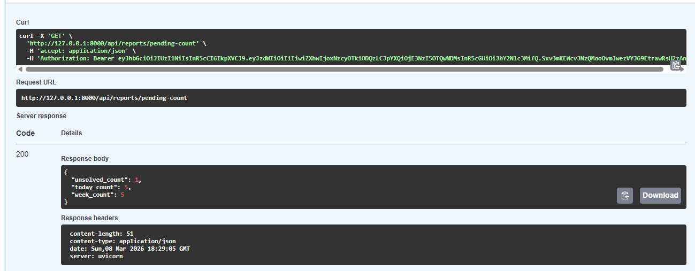
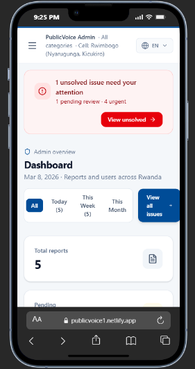
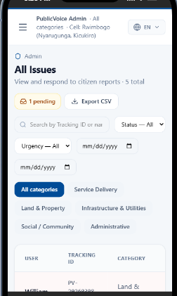
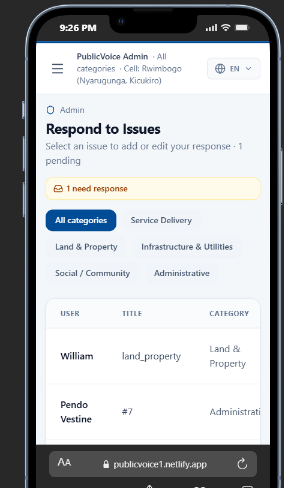

# PublicVoice

Civic engagement platform for Rwanda: citizens report issues in English or Kinyarwanda; AI translates and structures reports for admins.

- **Repository:** [GitHub – Public_Voice](https://github.com/vpendo/Public_Voice)
- **Deployed app:** [Frontend](https://publicvoice1.netlify.app) · [Backend API docs](https://public-voice1.onrender.com/docs)
- **Demo video ** [Demo (Google Drive)](https://drive.google.com/file/d/1pxpAqEp2TsBnOkESI6ZwRrnRnn7_e3JC/view?usp=sharing)

---

## Testing Results [Screenshots with relevant demos]

*Demonstration of the functionality under different testing strategies, with different data values, and performance on different hardware/software .*

### 1. Different testing strategies

Backend tests (pytest): auth, reports, API.



API documentation and manual testing (Swagger): registration endpoint.



### 2. Functionality with different data values

OTP verification (phone flow).



Citizen submits a report — success state.



Admin view: single report details (GET report by ID).



Admin: all users list.



Admin: pending reports dashboard.



### 3. Performance on different specifications

*Demonstration that the product runs correctly in different environments (per rubric).*

| Specification / Environment | Result |
|-----------------------------|--------|
| Local development (Windows/Mac, SQLite) | App runs; pytest passes; manual testing OK |
| Deployed (Netlify + Render, PostgreSQL) | Frontend and API live; auth and reports verified |
| **Responsiveness on mobile** | UI adapts to small screens; admin dashboard, issues list, and report flow tested on mobile viewport |

**Mobile responsiveness** — The app is responsive on mobile devices. Layout, navigation, and forms adapt to small screens; admin and citizen flows work on phones and tablets.







---

## Analysis

## Objectives achieved:
The system allows citizens to report community issues through the platform using phone-number registration and OTP verification. Reports are stored and displayed in the admin dashboard where administrators can review and update their status. Testing through pytest and Swagger confirmed that authentication, reporting, and API endpoints work correctly.

## Objectives missed or partial:
Advanced AI features for automatically structuring and analyzing reports were not fully implemented due to time constraints. SMS-based reporting for citizens without internet access was also not completed.

## Summary:
Overall, the project successfully developed a working civic engagement platform that enables citizens to report issues and helps administrators manage them.

---

## Discussion

*Importance of milestones and impact of the results (with supervisor).*

**Milestones:** The main milestones included developing the reporting system, implementing OTP authentication, improving functionalities based on supervisor feedback, and deploying the system online.

**Impact of results:** The platform supports civic engagement by providing citizens with a digital channel to report issues and enabling authorities to monitor community concerns more efficiently.

---

## Recommendations

*Recommendations to the community and future work (with supervisor).*

**For the community:** Local authorities could use platforms like PublicVoice to improve communication with citizens and better manage community issues.

**Future work:** Future development should involve engaging citizens and local authorities to understand their needs and integrating AI APIs to automatically structure and categorize reported issues.


## Install and Run (Step by Step)

### Prerequisites

- **Node.js** 18+ and **pnpm** (or npm)
- **Python** 3.10+ and **pip**
- **PostgreSQL** (optional; SQLite used if `DATABASE_URL` is not set)

### Step 1: Clone Repository

```bash
git clone https://github.com/vpendo/Public_Voice.git
cd Public_Voice
```

### Step 2: Backend Setup

```bash
cd Backend
python -m venv venv
```

**Activate virtual environment:**
- **Windows:** `venv\Scripts\activate`
- **macOS/Linux:** `source venv/bin/activate`

```bash
pip install -r requirements.txt
copy env.example .env   # Windows
# cp env.example .env   # macOS/Linux
```

**Edit `.env` file:**
- `SECRET_KEY` - required (generate: `openssl rand -hex 32`)
- `DATABASE_URL` - optional (PostgreSQL connection string)
- `CORS_ORIGINS` - frontend URL (e.g. `http://localhost:5173`)
- `OPENAI_API_KEY` - optional (for AI report processing)
- `AFRICAS_TALKING_USERNAME` - optional (for SMS OTP)
- `AFRICAS_TALKING_API_KEY` - optional (for SMS OTP)

**Create admin user:**
```bash
python -m scripts.create_admin
```

**Start backend:**
```bash
uvicorn main:app --reload --host 0.0.0.0 --port 8000
```

Backend runs at: **http://localhost:8000**  
API Docs: **http://localhost:8000/docs**

### Step 3: Frontend Setup

Open a new terminal:

```bash
cd Public_Voice/Frontend
pnpm install
```

**Optional:** Create `.env` file:
```env
VITE_API_URL=http://127.0.0.1:8000
```

**Start frontend:**
```bash
pnpm dev
```

Frontend runs at: **http://localhost:5173**

### Step 4: Verify Installation

1. Open **http://localhost:5173**
2. Register a citizen account (phone number + National ID)
3. Submit a report
4. Login as admin (use email and password from `create_admin`)
5. View and respond to reports in admin dashboard

---

## How to Use

### For Citizens

1. **Register:** Click "Register" → Enter full name, phone number, and National ID (16 digits)
2. **Verify Phone:** Enter OTP code sent to your phone
3. **Login:** Use phone number and full name
4. **Submit Issue:** Go to "Submit Issue" → Fill form → Submit
5. **Track Reports:** View "My Issues" to see status and admin responses

### For Admins

1. **Login:** Use email and password (created via `create_admin` script)
2. **Dashboard:** View statistics and recent reports
3. **All Issues:** Browse all submitted reports
4. **Respond:** Click on a report → Add response → Update status
5. **Users:** View and manage user accounts

---

## Related Files

| Purpose | Location |
|---------|----------|
| Backend API | `Backend/main.py`, `Backend/routers/` |
| Authentication | `Backend/routers/auth.py` |
| Reports | `Backend/routers/reports.py` |
| Database Models | `Backend/models/` |
| Frontend Pages | `Frontend/src/Pages/` |
| Frontend Components | `Frontend/src/Components/` |
| Configuration | `Backend/.env`, `Frontend/.env` |

---

## Technology Stack

- **Frontend:** React 19, TypeScript, Vite, Tailwind CSS
- **Backend:** FastAPI, Python 3.10+, JWT, bcrypt
- **Database:** SQLite (dev) / PostgreSQL (production)
- **AI/NLP:** OpenAI API (optional)

---

## Deployment

*Clear deployment plan; system deployed and verified in the target environment (per rubric).*

| Item | Detail |
|------|--------|
| **Frontend** | [Netlify](https://publicvoice1.netlify.app) — static site (Vite/React build) |
| **Backend** | [Render](https://public-voice1.onrender.com) — FastAPI; [API docs](https://public-voice1.onrender.com/docs) |
| **Tools** | Netlify (frontend), Render (backend), PostgreSQL on Render (or SQLite for dev) |
| **Environments** | Production: Netlify + Render. Local: `pnpm dev` + `uvicorn` (see Install and Run above). |
| **Verification** | Deployed app tested: frontend loads, API responds, auth and reports work (see Testing Results). |

**Steps to reproduce deployment:**
1. Frontend: connect repo to Netlify, build command `pnpm build`, publish directory `Frontend/dist`, set `VITE_API_URL` to backend URL.
2. Backend: connect repo to Render, Web Service, start command `uvicorn main:app --host 0.0.0.0 --port $PORT`, add env vars (e.g. `SECRET_KEY`, `DATABASE_URL`, `CORS_ORIGINS`).

---


## License

MIT License
